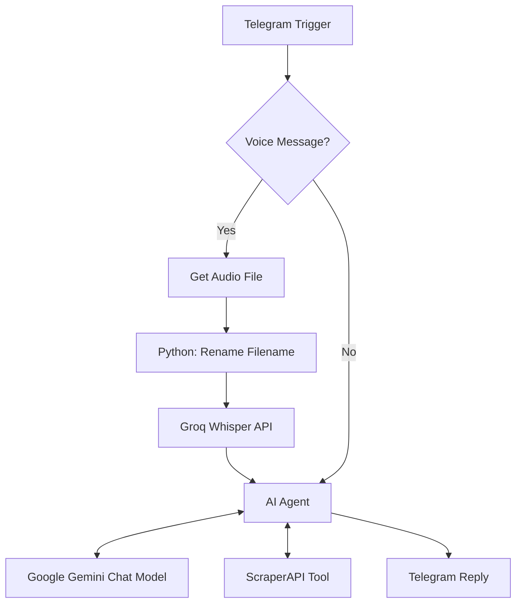

# AI Shopping Assistant 🛍️

An AI-powered Telegram shopping assistant built with **n8n, Google Gemini, Groq Whisper, and ScraperAPI**. Search for products on Amazon India, explore outfit ideas, and get personalized styling recommendations through text or voice messages.

## Workflow Preview

## Features

- **Product Discovery:** Search Amazon India based on product preferences and budget.
- **Product Details:** Present product names, prices, ratings, and links from available search results.
- **Personalized Styling:** Get outfit combinations, footwear recommendations, color coordination, and styling tips.
- **Voice Interaction:** Process Telegram voice messages through Groq Whisper speech-to-text transcription.
- **AI-Powered Responses:** Use Google Gemini through an n8n AI Agent.
- **Automated Replies:** Deliver shopping recommendations and styling advice directly in Telegram.

## Screenshots

### Telegram Chat

### Product Recommendations

### n8n Workflow

### AI Agent

## Architecture

## Technology Stack

| Technology | Purpose |
|---|---|
| n8n | Workflow orchestration |
| Telegram Bot API | User interaction and responses |
| Google Gemini | AI agent language model |
| Groq Whisper | Voice transcription |
| ScraperAPI | Amazon India search-page retrieval |
| Python | Audio filename handling |
| Amazon India | Product search source |

## Getting Started

### Prerequisites

- An n8n instance
- A Telegram bot created through [BotFather](https://t.me/BotFather)
- Google Gemini API access
- Groq API access
- A ScraperAPI account

### Import the Workflow

1. Download `AI-Shopping-Assistant-Workflow.json` from this repository.
2. Open your n8n instance.
3. Open the workflow editor and select **Import from File** from the three-dot menu.
4. Select the downloaded JSON file.
5. Configure the required credentials and API settings.
6. Review the workflow before executing it.

### 2. Configure Credentials

Set up the required credentials and API access for:

- **Telegram:** Bot credentials for receiving messages and sending replies.
- **Google Gemini:** API credentials for the Chat Model node.
- **Groq:** API key for the audio transcription HTTP Request node.
- **ScraperAPI:** API key for the product-search HTTP Request Tool node.

Review the HTTP Request nodes and ensure API keys are stored securely rather than hardcoded in the workflow JSON.

### 3. Test the Workflow

1. Test a text query, such as `Show me Puma shoes under ₹5,000`.
2. Test a styling question, such as `How can I style blue jeans?`.
3. Send a Telegram voice message and verify that transcription reaches the AI Agent.
4. Confirm that the final response is delivered to the correct Telegram chat.

Activate the workflow after verifying the required credentials and node configurations.

## Security

**Never commit API keys, bot tokens, or other secrets to version control.** Review workflow exports and screenshots before publishing them. Use n8n credentials or an appropriate secret-management mechanism for sensitive values.

## Project Highlights

This project demonstrates practical integration of AI agents, low-code automation, external APIs, web scraping, speech-to-text processing, and conversational interfaces.

**Skills:** n8n · AI Agents · Google Gemini · Python · REST APIs · Telegram Bot API · Groq Whisper · ScraperAPI

