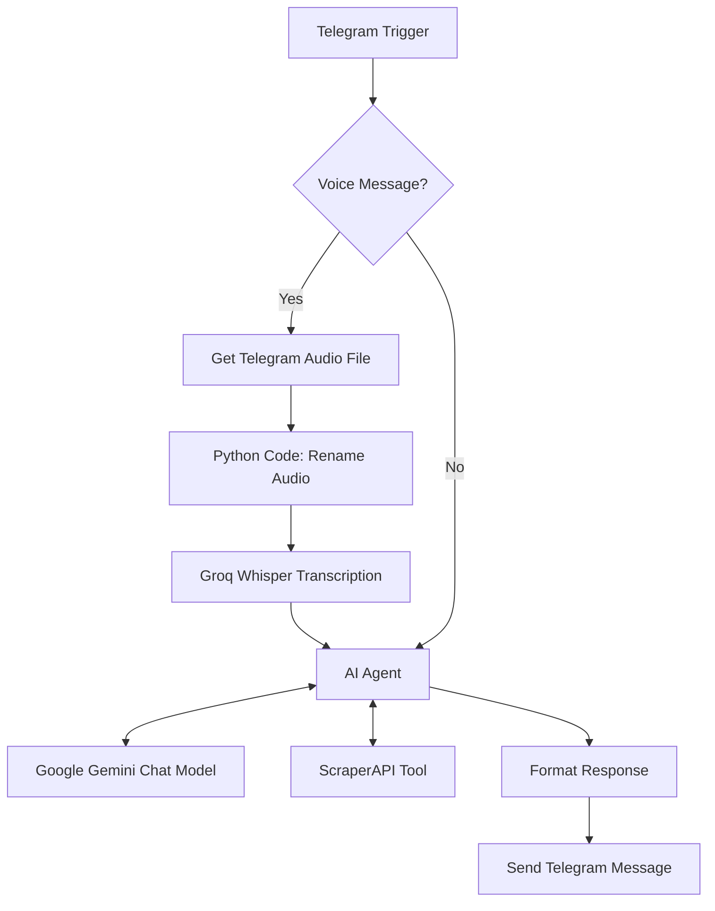

# 🛍️ AI Shopping Assistant — Telegram Bot | n8n, Gemini & ScraperAPI

An AI-powered shopping and styling assistant built with **n8n, Telegram, Google Gemini, Groq Whisper, and ScraperAPI**. The assistant helps users discover products on Amazon India, explore outfit combinations, get personalized styling advice, and interact through text or voice messages.

## ✨ Overview

Maya is a conversational shopping assistant designed to make product discovery and everyday styling easier. Users can send a message or voice note through Telegram, and the workflow processes the request and generates a response using an AI agent.

The workflow combines AI-powered conversation, web scraping, speech-to-text transcription, and automated Telegram messaging in a single low-code automation pipeline.

## 🚀 Key Features

- **🛒 AI Product Search:** Searches Amazon India for products based on user requests and budget preferences.
- **💰 Budget-Based Discovery:** Supports queries such as sneakers under ₹3,000 or shoes under ₹5,000.
- **🔎 Product Information:** Extracts available product names, prices, ratings, and links from search results.
- **👗 Personalized Styling Advice:** Provides outfit combinations, color coordination, footwear suggestions, accessories, and practical styling tips.
- **🎙️ Voice Message Support:** Downloads Telegram voice messages and sends the audio to Groq's Whisper transcription API.
- **🤖 AI-Powered Conversations:** Uses Google Gemini through the n8n AI Agent node to interpret requests and generate responses.
- **📩 Automated Telegram Replies:** Sends the generated response back to the user's Telegram chat.
- **⚙️ Workflow Automation:** Connects all processing steps through an n8n visual workflow.

## 🧰 Technology Stack

| Technology | Purpose |
|---|---|
| n8n | Workflow orchestration and automation |
| Telegram Bot API | User interaction and message delivery |
| Google Gemini | Natural-language understanding and response generation |
| Groq Whisper API | Voice-to-text transcription |
| ScraperAPI | Fetching Amazon India search-page content |
| Python Code node | Adjusting the downloaded voice file's filename |
| Amazon India | Product discovery source |

## 🏗️ Workflow Architecture

### High-Level Flow

### Workflow Components

**1. Telegram Trigger**

Listens for incoming Telegram message updates and provides the message content and chat information.

**2. If — Message Type Detection**

Checks whether `message.voice` exists to determine whether the incoming message is a voice note or a regular text message.

**3. Get a file**

Downloads the Telegram voice file using its `file_id`.

**4. Code in Python**

Updates the downloaded audio filename by replacing the `.oga` extension with `.ogg`.

**5. HTTP Request1 — Groq Transcription**

Sends the audio file to the Groq audio transcription endpoint using the `whisper-large-v3-turbo` model. The configured request uses multipart form data and requests a verbose JSON response.

**6. AI Agent — Maya**

Interprets the user's request and selects the appropriate response approach:

- Product requests: prepares an Amazon India search URL and invokes the ScraperAPI tool.
- Styling requests: provides outfit advice and asks relevant questions when more context is needed.

**7. Google Gemini Chat Model**

Provides the language model used by the AI Agent.

**8. HTTP Request — ScraperAPI Tool**

Fetches Amazon India search-page content using a URL supplied by the AI Agent. The node is configured to return HTML content associated with the `div.s-search-results` CSS selector.

**9. Send a text message**

Sends the AI Agent's output to the original Telegram chat.

## 🔄 How It Works

### Product Search

Example user message:

> Show me Puma shoes under ₹5,000.

The workflow follows this sequence:

1. Receives the request through Telegram.
2. Routes the text message directly to the AI Agent.
3. Generates an Amazon India search URL based on the requested product and budget.
4. Calls ScraperAPI to retrieve the search-page content.
5. Uses the AI Agent to prepare a concise product list from the available information.
6. Sends the response back through Telegram.

The configured instructions specify a maximum of five products per search, with product names, prices, ratings, and Amazon links where available.

### Styling Advice

Example user message:

> How can I style a blue kurti for a casual outing?

Maya can provide recommendations covering:

- Outfit combinations and suitable bottoms
- Footwear and accessories
- Color coordination
- Fabric and occasion considerations
- Practical styling tips

When necessary, the assistant can ask about the occasion, preferred style, colors, and weather before personalizing its suggestions.

### Voice Message Processing

Example: A user sends a Telegram voice note asking for running shoes under ₹2,000.

1. Telegram Trigger receives the voice message.
2. The If node detects the voice attachment.
3. Get a file downloads the audio.
4. The Python node changes the audio filename extension from `.oga` to `.ogg`.
5. The Groq API transcribes the audio.
6. The AI Agent receives the transcription and processes the request.
7. The final response is sent to Telegram.

**Implementation note:** The current workflow sends the transcription response to the AI Agent, but its prompt expression references `message.text`, `text`, or `segments[0].text`. Ensure the expression maps to the actual transcription field returned by Groq; otherwise, voice requests may not reach the agent as intended.

## ⚙️ Setup and Configuration

### Prerequisites

- An n8n instance
- A Telegram bot created through BotFather
- A Google Gemini API credential
- A Groq API key
- A ScraperAPI account and API key

### 1. Import the Workflow

1. Export the workflow JSON from your n8n instance.
2. Open n8n.
3. Select **Import from File**.
4. Choose the workflow JSON.
5. Open the imported workflow and review its nodes and connections.

### 2. Configure Telegram

1. Create a Telegram bot using BotFather.
2. Add the bot token as an n8n Telegram credential.
3. Select the credential in the Telegram Trigger and Telegram messaging nodes.
4. Start a conversation with the bot and send a test message.

### 3. Configure Google Gemini

1. Create or select a Google Gemini API credential in n8n.
2. Assign it to the Google Gemini Chat Model node.
3. Confirm that the selected model is available to your API account.

The supplied workflow references `models/gemini-3.7-flash`. Confirm model availability before executing the workflow.

### 4. Configure Groq

1. Create a Groq API key.
2. Open the `HTTP Request1` node.
3. Set the authorization header using the new key.
4. Confirm that the request uses the configured transcription endpoint and multipart form-data settings.

Use n8n credentials or another secure secret-management method instead of committing API keys to the workflow JSON.

### 5. Configure ScraperAPI

1. Create a ScraperAPI account and obtain an API key.
2. Open the `HTTP Request` tool node.
3. Configure the `api_key` query parameter securely.
4. Ensure the `url` parameter receives the Amazon India search URL generated by the AI Agent.
5. Verify the response selector and returned content using a test query.

### 6. Test and Activate

Test the workflow with both text and voice messages. Verify that product requests invoke the scraping tool, styling questions produce useful advice, and responses return to the correct Telegram chat.

Once all required credentials, expressions, and node configurations are validated, activate the workflow.

## 🔐 Security

- Never commit Telegram bot tokens, Gemini credentials, Groq API keys, or ScraperAPI keys to GitHub.
- Store credentials in n8n's credential manager or an appropriate secret-management system.
- Remove sensitive values from exported workflow JSON before sharing it.
- Rotate any API key that has been exposed publicly.
- Avoid logging sensitive user messages or credentials unnecessarily.

## ⚠️ Current Limitations

- Product information depends on the content returned by ScraperAPI and Amazon India.
- Product prices, ratings, availability, and links may change.
- The workflow does not define a separate persistent memory node, so long-term conversational memory is not configured in the supplied JSON.
- Voice transcription depends on valid Groq credentials and correct binary-file handling.
- The voice branch requires the AI Agent prompt to read the actual transcription output field.
- The supplied workflow export has `"active": false`; activation must be performed in n8n after configuration and testing.
- The workflow has not been verified to handle every Telegram attachment type or every possible scraping failure.

## 🚧 Future Enhancements

- Add persistent conversation memory for more personalized recommendations.
- Improve product extraction with structured parsing and validation.
- Add price-range validation and sorting of products by relevance or rating.
- Provide clearer error handling for API failures and empty search results.
- Support additional marketplaces and product categories.
- Add automated workflow tests and execution monitoring.
- Improve voice transcription mapping and multilingual support.

## 🎯 Project Outcome

This project demonstrates how AI agents and low-code automation can be combined to build a conversational shopping assistant. It integrates Telegram messaging, language-model reasoning, external product-data retrieval, and speech-to-text processing into a unified workflow.

**Core skills demonstrated:** n8n workflow automation, API integration, prompt engineering, AI agents, web scraping, speech-to-text processing, Python, and conversational bot development.

## 📄 License

Choose a license appropriate for your repository before publishing. If you intend to make the project open source, consider the MIT License.

---

*Built with n8n, Google Gemini, Groq, ScraperAPI, and Telegram.*
