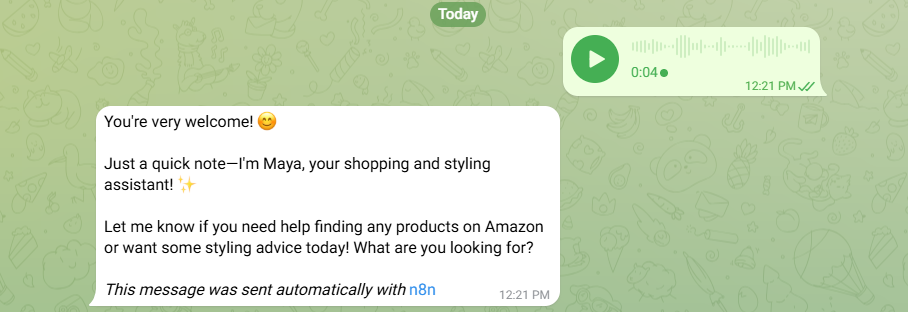
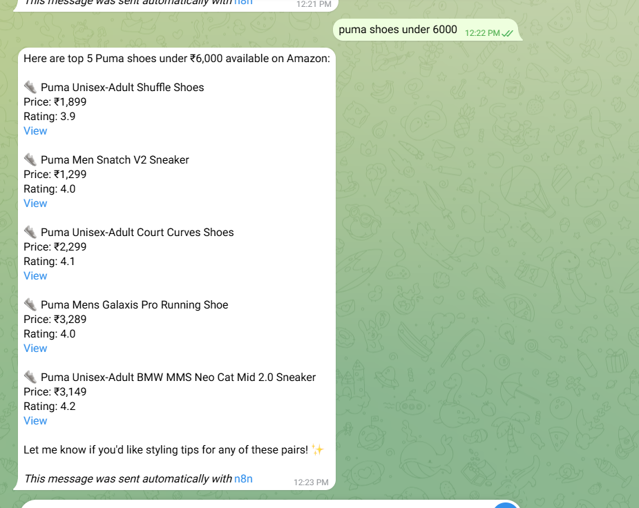
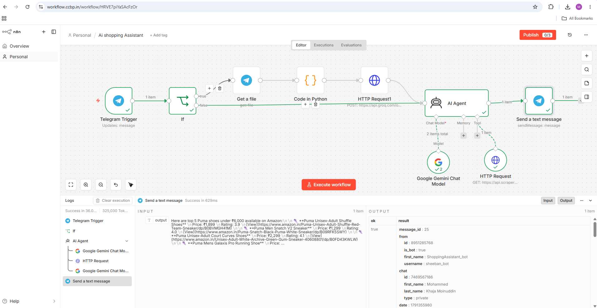
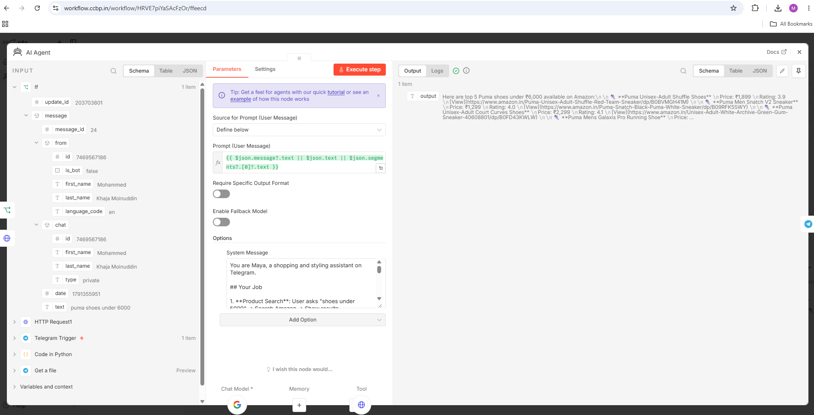

# AI Shopping Assistant 🛍️

An AI-powered shopping and styling assistant built with **n8n, Telegram, Google Gemini, Groq Whisper, and ScraperAPI**. Search Amazon India products, discover relevant deals, and receive personalized styling recommendations through text or voice messages.

## Overview

Online shopping often involves comparing numerous products, prices, and ratings. This project simplifies product discovery by bringing conversational AI and product search into Telegram.

The assistant, Maya, accepts natural-language queries, retrieves product information through ScraperAPI, and uses an AI agent powered by Google Gemini to generate relevant responses and styling advice.

It also supports voice input by transcribing Telegram voice messages into text using the Whisper speech-to-text model hosted by Groq.

## Features

- **Product discovery:** Search Amazon India using natural-language queries and budget preferences.
- **Product information:** Present available product names, prices, ratings, and links.
- **Personalized styling:** Generate outfit ideas, footwear recommendations, color combinations, and fashion advice.
- **Voice input:** Accept Telegram voice messages and transcribe them into text.
- **AI-powered conversations:** Use Google Gemini through an n8n AI Agent to interpret requests and formulate responses.
- **Workflow automation:** Connect message handling, voice transcription, product search, and replies using n8n.

## Screenshots

### Telegram conversation

### n8n workflow

### AI Agent configuration

## How It Works

### Text-based product search

1. The user sends a shopping query through Telegram.
2. The Telegram Trigger receives the incoming message.
3. The message is passed to the n8n AI Agent.
4. Google Gemini interprets the request and determines whether product search is needed.
5. For product searches, the agent uses the ScraperAPI HTTP Request tool to retrieve Amazon India product information.
6. The agent prepares a relevant response using the available results.
7. The response is sent back to the user through Telegram.

### Voice-based interaction

1. The user sends a voice message through Telegram.
2. The workflow checks the message type using an If node.
3. The Telegram Get File node retrieves the voice file.
4. A Code node changes the `.oga` filename extension to `.ogg` for the transcription request.
5. An HTTP Request node sends the audio to Groq's Whisper speech-to-text API.
6. The resulting transcription is routed to the same AI Agent used for text messages.
7. The agent processes the request and sends its response through Telegram.

**Key design principle:** Both text and voice inputs converge on the same AI Agent, avoiding separate shopping logic for each input type.

## Technology Stack

| Technology | Purpose |
|---|---|
| n8n | Workflow orchestration and integration |
| Telegram Bot API | User interaction and message delivery |
| Google Gemini | Natural-language understanding and AI-generated responses |
| Groq Whisper API | Speech-to-text transcription |
| ScraperAPI | Retrieval of Amazon India product search results |
| HTTP Request node | API communication |
| If node | Routing messages by type |
| Telegram Get File node | Downloading voice-message files |
| Code node (Python) | Preparing the voice-file format for transcription |

## Setup and Configuration

### Prerequisites

Before importing the workflow, prepare:

- An n8n instance.
- A Telegram bot and bot token created using [BotFather](https://t.me/BotFather).
- A Google Gemini API key.
- A Groq API key with access to the required speech-to-text model.
- A ScraperAPI API key and an appropriate subscription or usage allowance.

### 1. Download and Import the Workflow

1. Open the [AI-Shopping-Assistant-Workflow.json](./AI-Shopping-Assistant-Workflow.json) file in this repository.
3. Download the JSON file to your computer.
4. Open your n8n instance.
5. Select **Import from File** and choose the downloaded JSON file.
6. Review the imported nodes, connections, and workflow configuration.

> The workflow JSON is already included in this repository. You do not need to export another workflow from your own n8n instance.

### 2. Configure Credentials

Configure the credentials or API authentication required by the imported nodes:

- **Telegram:** Bot API credentials.
- **Google Gemini:** Gemini API credentials for the AI Agent's language model.
- **Groq:** API key for the Whisper transcription request.
- **ScraperAPI:** API key used by the product-search HTTP Request tool.

If any credentials, model selections, request parameters, or expressions require manual configuration after import, review them before execution.

### 3. Activate and Test

1. Confirm that all required credentials are configured.
2. Verify the AI Agent's system instructions and product-search tool connection.
3. Test a text query, such as `Find running shoes under ₹5,000`.
4. Test a styling query, such as `How can I style blue jeans?`.
5. Send a Telegram voice message and verify that transcription reaches the AI Agent.
6. Confirm that the resulting response is delivered to the Telegram conversation.

The exact setup may vary with your n8n version and the credential configuration of the imported workflow.

## Security

- Keep Telegram bot tokens and API keys private.
- Configure credentials inside n8n rather than committing secrets to the repository.
- Review the imported workflow for embedded credentials or sensitive configuration before sharing it.
- Check third-party API pricing, quotas, and data-handling policies before use.

## Project Scope

This project demonstrates an AI-assisted shopping workflow that combines conversational AI, external product retrieval, and voice-input processing in a single automated system. Product availability, prices, and ratings depend on the returned search data and may change over time.

---

**Author:** [Mohammed Khaja Moinuddin](https://www.linkedin.com/in/mohammed-khaja-moinuddin05/)
